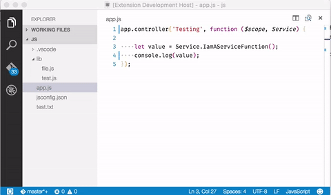

# Fuzzy Definitions

A more graceful way to go to definition in JavaScript files. Will compute definitions by running
a workspace symbol search and by running a textual query.

This is extension helps when types cannot be inferred by the JavaScript language service, for instance
with angular service injections.

By default this extensions hooks up with the *Go to Definition* feature - which means its results
are being merged with other providers. This can be configured using `fuzzydefinitions.integrateWithGoToDefinition`
and fuzzy definitions can be invoked straight via `F1 > Go to Fuzzy Definitions`.

# Release Notes

### 0.0.3

* back to global nodejs
* encode arguments such that it works on windows

### 0.0.2

* use the same nodejs version VS Code uses
* kill fulltext search after 2 seconds
* don't attempt to search `node_modules` folder

### 0.0.1

* proof of concept
